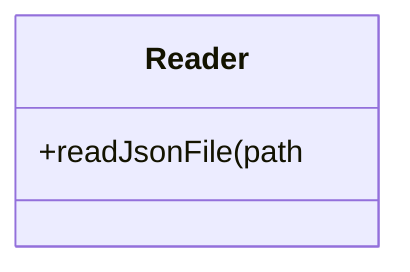
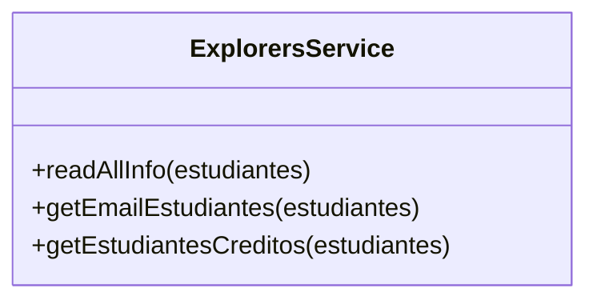
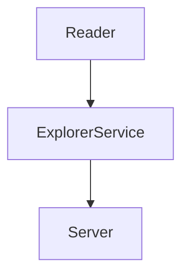

# Code Challenge - Cursos de Visual Thinking API

Requerimientos:
1. Habilitar un endpoint para consultar todos los estudiantes con todos sus campos.
2. Habilitar un endpoint para consultar los emails de todos los estudiantes que tengan certificación `haveCertification`.
3. Habilitar un endpoint para consultar todos los estudiantes que tengan `credits` mayor a 500.

#Solución (tiempo de desarrollo: 1 hora y 17 minutos)

Dependencias:
- Se emplea la dependencia Jest para la ejecución de pruebas unitarias para llevar un proceso más ordenado de desarrollo siguiendo la práctica TDD:
  
  `npm install -save jest`

- Se emplea también la dependencia ESLint para la limpieza de código con el objetivo de darle calidad y corregir errores de sintaxis:

  ```
  npm install -save eslint
  npm init @eslint/config
  ```
  
- Por último, se emplea la dependencia Express para el desarrollo y puesta en marcha de un servidor web básico para la API y sus endpoint requeridos:

  `npm install -save express`
  
Componentes:
1. Se propone una solución donde existan dos componentes, uno especializado únicamente para acceder a la base de datos y otro que se encargue de llevar a cabo lass funcionalidades de los requerimientos propuestos:





2. Para iniciar, se propone una prueba para comprobar un correcto acceso a la base de datos (archivo visualpartners.json)

  ```
  test("1) Lectura de archivo correcta", () => {
    const explorers = Reader.readJsonFile("visualpartners.json");
    expect(explorers).not.toBeNull();
  });
  ```
    
3. Esta prueba se resuelve por medio de una clase llamada Reader la cual accede al archivo de base de datos y hace un retrieve de los datos que esta contiene:

  ```
  class Reader{
    static readJsonFile(path){
      const rawdata = fs.readFileSync(path);
      return JSON.parse(rawdata);
    }
  }
  ```
  
4. Ya teniendo el acceso a la base de datos, solo se propone una clase más que logre ejecutar los tres requerimientos solicitados, llamada ExplorersService. Para poder llevarlo a cabo, inicializamos las pruebas de dicha clase:

  ```
  test("1) Consulta todos los estudiantes", () => {
    const explorers = Reader.readJsonFile("visualpartners.json");
    const datosEstudiantes = ExplorerService.readAllInfo(explorers);
    expect(datosEstudiantes.length).toBe(51);
  });

  test("2) Obtiene emails de todos los estudiantes con certificacion", () => {
    const explorers = Reader.readJsonFile("visualpartners.json");
    const emailsEstudiantes = ExplorerService.getEmailEstudiantes(explorers);
    expect(emailsEstudiantes.length).toBe(29);
  });

  test("3) Estudiantes con credits mayores a 500", () => {
    const explorers = Reader.readJsonFile("visualpartners.json");
    const listaEstudiantesCredits = ExplorerService.getEstudiantesCreditos(explorers);
    expect(listaEstudiantesCredits.length).toBe(27);
  });
  ```
  
5. Y para darle solución, se desarrollaron tres funciones en la clase mencionada para cumplir con las pruebas instanciadas y así cumplir los requerimientos:

  ```
  static readAllInfo(estudiantes){
    return estudiantes;
  }
  static getEmailEstudiantes(estudiantes){
    const emailList = estudiantes.filter(estudiante => estudiante.haveCertification).map((estudiante) => estudiante.email);
    return emailList;
  }
  static getEstudiantesCreditos(estudiantes){
    const estudiantesCreditos = estudiantes.filter((estudiante) => estudiante.credits > 500);
    return estudiantesCreditos;
  }
  ```
  
6. El objetivo de esta clase es estar conectada directamente con la clase Reader para leer de la base de datos, y a su vez estar conectada con el servidor que proporcionará la API. Es decir, se tiene la siguiente estructura de componentes:



7. Por último, para el desarrollo de la API se requiere de los siguientes endpoints:

| Endpoint | Request | Response |
|---|---|---|
| `localhost:3000/v1/estudiantes` | `localhost:3000/v1/estudiantes` | Se deberá obtener la información de todos los estudiantes con todos sus campos |
| `localhost:3000/v1/estudiantes/emails` | `localhost:3000/v1/estudiantes/emails` | Se deberá obtener el email de todos los estudiantes que tengan una certificación |
| `localhost:3000/v1/estudiantes/creditosMinimos` | `localhost:3000/v1/estudiantes/creditosMinimos` | Se deberá obtener la información de todos los estudiantes que tengan credits mayores a 500 |

8. En el caso del primer endpoint, se observa que este retorna toda la información de todos los estudiantes cuando se consulta:


9. Para el segundo endpoint, se observa cómo este retorna únicamente una lista de emails, la cual corresponde a los estudiantes que cuentan con una certificación de acuerdo a la información dada por la base de datos:


10. Y por último, el tercer endpoint requerido nos muestra la información de todos aquellos estudiantes que cuenten con un score mayor a 500:


